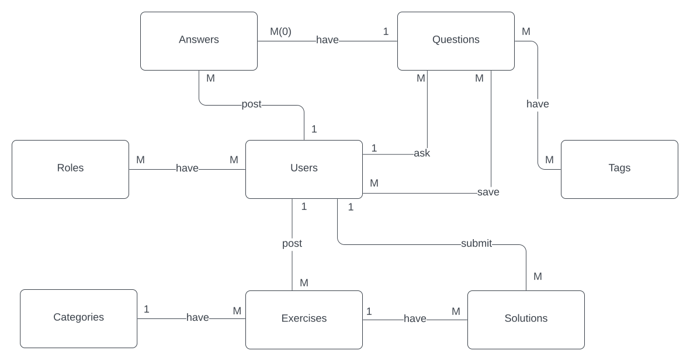
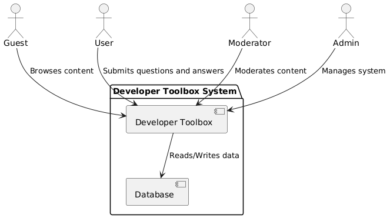
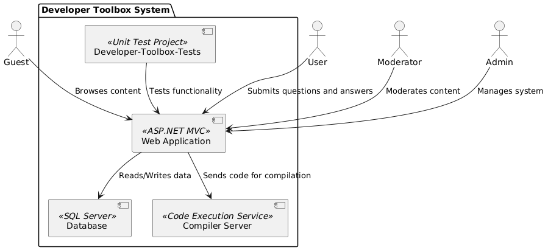
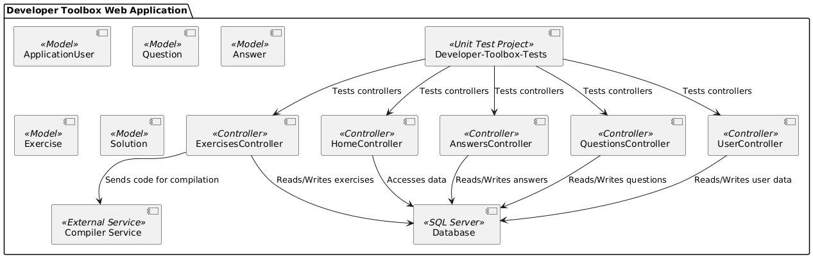
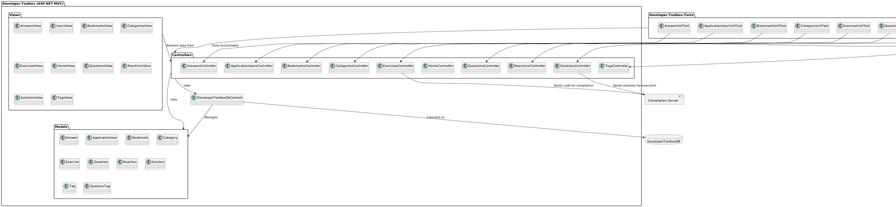
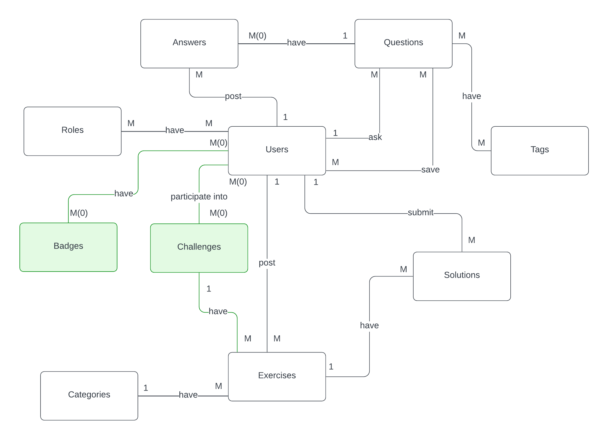
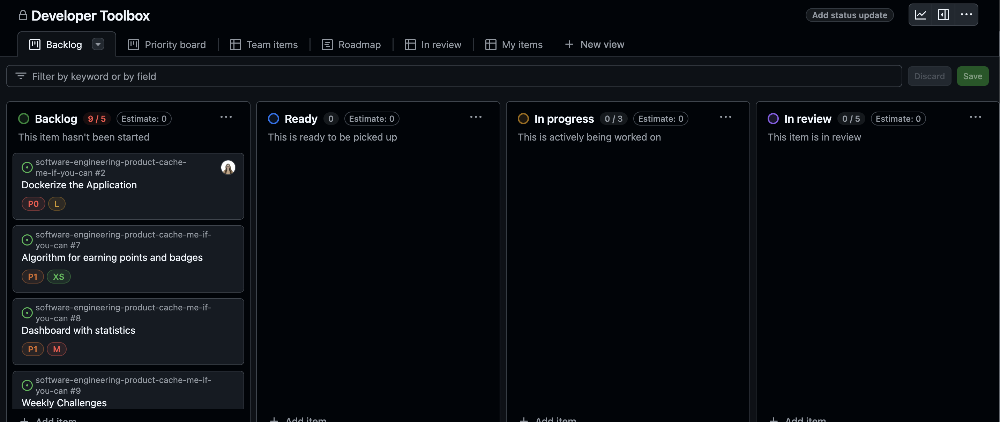

# Developer Toolbox :rocket:
## Documenting the existing application 
### Completed user stories:
* As an unregistred user, I want to see others' questions and answers.
* As user, I want to login.
* As user, I want to ask technical questions and receive answers.
* As user, I want to answer others' questions.
* As user, I want to have a profile.
* As user, I want to rate questions and answers.
* As user, I want to save questions and answers.
* As user, I want to search specific questions or a tag.
* As user, I want to browse a variety of coding exercises
* As user, I want to be able to select and attempt coding exercises directly within the app, within a code editor.
* As a moderator, I want to manage the content and exercises available on the platform
* As a moderator, I want to delete a post or a comment if it violates community guidelines. 
* As an administrator, I want to manage the content and exercises available on the platform
* As an administrator, I want to delete a post or a comment if it violates community guidelines. 
* As an administrator, I want to manage user roles and account details.
* As an administrator, I want the capability to delete user accounts.

### Unachieved user stories
* As user, I want to track my progress and performance over time. 

   **Analysis of Unachieved User Story:**

   - **Reason for Incompletion:**  
     The progress-tracking feature was partially implemented but faced challenges due to the complexity of tracking and visualizing user metrics, as well as time constraints during the development phase.
  
   - **Future Development Recommendation:**  
     Yes, this user story should be included in the next development phase, as it would add significant value for users who wish to monitor their learning journey and improvement.

   - **Tactics to Ensure Completion:**  
     - **Scope Reduction:** Begin with a minimal approach, focusing initially on simple metrics like the number of completed exercises or questions answered.
     - **Clear Specifications:** Define specific progress metrics early on to avoid ambiguity and align development efforts.
     - **Incremental Development:** Break down the feature into smaller tasks, such as tracking completion status and quiz scores, allowing for gradual deployment.
     - **Regular Testing and Feedback:** Engage users for feedback during development to fine-tune metrics and display preferences.
---

## Team Description

Our team collaborated closely on the development of the MDS project, with each member contributing specific skills and focusing on various components. We implemented the Model-View-Controller (MVC) architecture by dividing tasks based on project components, ensuring efficient and organized development.

### Team Members

- **Ciurescu Irina Alexandra**
  - **Role:** Development & QA
  - **Responsibilities:** Led the development of specific application components, like User Roles & Authetication. Later focused on creating and executing tests to ensure code quality and reliability.

- **Stoinea Maria Miruna**
  - **Role:** Development & QA
  - **Responsibilities:** Focused on developing  components, like Questions & Answers forum, and joined Ciurescu in testing to validate the application’s functionality.

- **Toma Alexandra**
  - **Role:** Development
  - **Responsibilities:** Focused on developing  components, like Exercises and Categories. Worked on backend server development for the compiler functionality and code editor integration.

- **Macovei Cătălina**
  - **Role:** Development
  - **Responsibilities:** Focused on developing  components, like Tags, Bookmarks and Solutions for Exercises. Then, primarly worked on the backend server for the compiler functionality and integrating the code editor.

- **Predicted Changes:** No changes predicted in team members roles.

Each team member’s contributions were integral to completing the project, starting from creating diagrams and reaching the development process. As the project progresses, roles may naturally evolve, but no immediate changes in responsibilities are anticipated.

---

# Software Architecture Report

## Overview
This document outlines the architectural decisions made in the previous iteration of our project, along with a discussion of their effectiveness. Diagrams created during the design phase are referenced here to explain key decisions.

#### :link: Repository links: 
The project was added to the current repository, however, you can follow the activity by accessing these repositories:
* **Developer Tools:** https://github.com/catalina-macovei/Developer-Toolbox.git

* **Backend Server:** https://github.com/catalina-macovei/backend-server.git

## a. Technologies Used

Our project leverages a set of technologies chosen for their compatibility, performance, and suitability for the application’s requirements:

- **ASP.NET Core, C#**: A high-performance framework for building web applications with support for MVC architecture and built-in dependency injection.
- **Entity Framework Core, LINQ**: A tool for data access in .NET applications, making it easier to interact with the database using LINQ.
- **SQL Server**: A robust relational database management system to handle data persistence.
- **JavaScript, HTML, CSS**: For some frontend tasks, providing a responsive and interactive user interface.
- **Python**: For backend server implementation, helped in bulding the compiler logic.
- **xUnit**: Used for unit tests, allowing us to test individual components in isolation.
- **Moq**: Enabled us to mock dependencies, making it easier to test controllers and services without relying on external data sources.

These technologies helped answering to project’s requirements.

## b. Architectural Patterns Implemented

### 1. Model-View-Controller (MVC) Architecture
- **Overview**: The application follows the MVC architectural pattern, which organizes the project into three main components:
  - **Model**: Contains the core application data and business logic, represented by classes such as `Answer`, `ApplicationUser`, `Bookmark`, `Question`, etc.
  - **View**: Manages the user interface and presentation logic, including views like `Index`, `Edit`, and `Show`.
  - **Controller**: Handles user requests, updates the model, and renders views in response to user actions.
- **Effectiveness**: The MVC pattern enhanced separation of concerns, code readability, and maintainability. It allowed for a well-organized codebase, making testing and debugging more efficient.

### 2. Client-Server Architecture
- **Overview**: The application adheres to a client-server model with a separation between client-side components (views) and server-side components (controllers, models, and data access).
- **Effectiveness**: This architecture enhanced scalability by allowing independent management of client and server resources. It also provided flexibility for future integration with additional front-end or back-end services.

## c. Coding Standards and Principles
We established and enforced several coding principles, such as:
- **Code Modularity**: Each function handles a single responsibility, and reusable code is organized into separate modules.
- **Naming Conventions**: Descriptive and consistent naming for variables, functions, and classes.
- **Code Documentation**: Inline comments and method descriptions were added to enhance readability and maintainability.
- **Exception Handling**: Implemented robust exception handling to manage errors gracefully.

## d. Faults Discovered During Development
During the development process, the following issues were identified:
- **Data Retrieval Issues**: Some database queries did not retrieve the data properly, leading to inaccuracies in the results.
- **Dependency Management Issues**: Unresolved dependencies between in certain areas led to errors.
- **Local Environment Security Risks**: Executing exercise files in the local environment poses security risks. While we did not use Docker containers during development, implementing Dockerization would enhance code versioning and provide a more secure environment for executing these files.

These issues have been partially addressed, and optimization efforts are ongoing.

## e. Areas for Refactoring
Based on our observations, the following areas would benefit from refactoring:
- **Database Query Optimization**: Some queries need further optimization to enhance performance.
- **Dockerization**: Transitioning to a Docker-based architecture would improve security and improve the execution of exercise files, mitigating the risks associated with running them in a local environment.

## MDS Diagrams from last year 

### Entity Relationship Diagram

  

### UML Diagram

  

### Workflow Diagram

  

### Gantt Chart - development process in time

  

---

# Product Vision
FOR coding enthusiasts WHO seek an interactive platform for learning programming languages and collaborating, Developer Toolbox is a web-based platform that combines a discussion forum with programming exercises, instantly tested via an integrated compiler. UNLIKE other platforms that separate forums from hands-on coding, OUR PRODUCT seamlessly integrates both, offering a comprehensive and interactive learning experience.

---

## Diagrams from this year, designed for visualizing software architecture

### Context Diagram

  

### Container Diagram

  

### Component Diagram

  

### plantUML

  

### ERD

  

# Functional requirements
 - The platform should facilitate users to practice solving problems and to share knowledge.
 - The platform should allow users to ask and answer technical questions.
 - The platform should improve content by letting users provide feedback to questions and answers.
 - The platform should ease finding already asked questions related to a certain topic.
 - The platform should allow moderators to manage posted content. 
 - The platform should provide domain-classified coding exercises of different levels of difficulty.
 - The platform should provide an environment where users can code the solution of the exercises on the platform and should evaluate the submitted solutions.
 - The platform should make learning and practicing more attractive by rewarding users that ask for help, answer questions or solve exercises with reputation points and badges.
 - The platform should provide a leaderboard, ranking users by the contribution on the platform.
 - The platform should provide a detailed image of the user's progress in their private dashboard, where they can consult statistics of their activity.
 - The platform should motivate users by inviting them to participate in weekly challenges, where they find a competitive environment, exciting exercises to solve and rewards to win.
 - The platform should provide a learning paths section. A learning path contains difficulty-ordered exercises with detailed explanations and instructions. The exercises should be unlocked progressively, respective to the user’s experience.
 - The platform should provide email notifications for significant events and actions on the platform.

# User Personas
## Andreea, a Computer Sciences student
Andreea, age 19, is a first-year student at Faculty of Mathematics and Informatics of University of Bucharest. She was born in Bucharest as an only child, her mother works as a high school teacher and her father as a project manager. She has always been enthusiastic about technology and innovation, always trying to find out how things work. Andreea is permanently searching for new experiences and wants to have insights in lots of domains. 
She loves sport competitions and she trains daily for marathons.
  Andreea wants to experiment with new technologies and to understand what a career in IT looks like. Her short-term goal is to achieve some knowledge in multiple different topics and not get limited by the subjects she studies at faculty. Andreea would use the Developer Toolbox platform to learn the basics of new programming languages and to take the first steps into diverse career paths, trying to decide what she likes to do most. Also, she would want to ask experienced users about their job requirements and advice in her career decision.

## Cristi, a full-stack developer
Cristi, age 27, is a 5-year experienced full-stack developer at a multinational corporation. He was born in Brasov, but came to Bucharest for his Bachelor’s studies. He graduated a Master’s degree in Software Engineering and decided to stay in Bucharest for a few more years.
  Cristi enjoys being a team leader for the interns team, he likes to help his new inexperienced colleagues when they need it, to answer their questions and to guide them in their learning journey. He has excellent communication and leadership skills and is always up-to-date with the newest trends in his domain. Cristi would like to become a moderator on the Developer Toolbox platform in order to get involved in the exercises and challenges creation and in order to ensure that the application and its community remain an enthusiastic and welcoming place for the users. Moreover, Cristi would like to share his knowledge on the forum and to practice advanced-leveled and interview type exercises.

# Product features
| Input                                      | Activation                                             | Action                                                                 | Output                                                                                           |
|--------------------------------------------|-------------------------------------------------------|------------------------------------------------------------------------|--------------------------------------------------------------------------------------------------|
| User’s chosen coding exercise               | User submits solution to exercise                      | The user’s code is compiled and run on test cases                    | User’s score for the exercise                                                                     |
| Logged user                                 | User submits a technical question                      | The question is saved in the database                                 | New question visible for the other users that can receive answers, likes and dislikes            |
| Categories of exercises                     | User selects a domain for practicing                   | A list of exercises related to the domain is selected                | List of exercises of the selected category                                                        |
| Collection of tags                          | User selects one tag                                   | Selection of questions classified under the tag is generated          | List of questions classified under the tag                                                        |
| User’s data and activity in application     | User access their profile                              | The information about the user is gathered and some statistics are calculated | User’s profile details, their reputation points and statistics about the questions asked, the answers provided and the exercises solved |
| Moderator or admin logged                   | User adds an exercise to be solved: the task and the test cases | The exercise is saved in the database                                 | New exercise available for users to solve                                                         |
| The exercises proposed in the app          | User search for keywords                               | The exercises that contain the searched keywords in their title or their task description are returned | A list of the exercises searched for that can be sorted by the level of difficulty               |
| Question posted on the platform            | User submits an answer                                | The answer is saved in the database and the author of the question answered is notified by email | New answer on the platform and a notification for the author’s question                           |
| Question posted on the platform            | User saves a question                                 | The question is saved as a bookmark for the user                     | The question is available for the user in the bookmarks section when the question receives a new answer |
| Moderator or admin logged                   | User adds a new topic as tag                          | Tag is saved in the database                                          | An available tag for users to choose when asking questions                                        |
| Moderator or admin logged                   | User removes a question/answer that violates platform’s policy | Question/answer is deleted and the author of it is notified by email  | Removal of the question/answer from the platform and its author’s information that they violated platform’s policy |
| User’s chosen exercise                      | User chooses the preferred programming language for solving the exercise | Code editor is adapted to the programming language chosen and the previous content is temporarily stored | Switch between desired programming languages without losing progress                              |
| Rewarding policy                            | User solves exercises and answer questions             | User is rewarded for their actions according to the rewarding policy   | Badges and reputation points achieved by the user, visible in their dashboard                     |
| Users’ contribution                         | User access the leaderboard                            | A ranking of the users respective to the owned reputation points is calculated | User’s rank in the leaderboard and theirs or the other users’ contribution                       |
| Collection of special locked exercises for learning | User receives reputation points and badges            | Exercises are unlocked respective to the owned amount of reputation points and badges | Unlocked exercises for user to solve                                                               |
| Moderator or admin account                  | User suggests exercises and a deadline for solving them as a (weekly) coding challenge | Coding challenge is scheduled and the users subscribed to the newsletter receive information by email | Suggested exercises that users can solve as challenge during the period of time set               |
| Ongoing coding challenge                    | User submits solution to the ongoing coding challenge  | Solutions are compiled and run                                        | User’s score for the challenge and reputation points and badges received for completing the challenge |

---

# User Stories

- As a user, I want to have access to a dashboard where I can see statistics about my progress.
- As a user, I want to earn points and badges for answering questions, solving exercises, and contributing to the community.
- As a user, I want to participate in weekly coding challenges to test and improve my skills, and earn extra points and badges.
- As a user, I want to unlock exercises gradually, based on my progress or points, to keep me motivated and challenge me progressively.
- As a user, I want to receive email notifications when I get an answer to my question, so I can stay updated even when I’m not on the platform.
- As a user, I want to see my position on the leaderboard so that I can understand how I rank compared to other users and feel motivated to improve my performance.
- As an administrator, I want to create and manage weekly challenges, including setting difficulty levels, deadlines, and rewards.
- As an administrator, I want to manage and update exercise unlock criteria, to keep users engaged and on track with platform learning goals.
- As an administrator, I want to control the email notification settings to manage how often users receive updates.

# Backlog
:link: Task prioritization in Projects Kanban Board: https://github.com/orgs/unibuc-cs/projects/48

  

- **Dockerizing the Application**
  - Create 2 Docker images for .NET App and Backend Server
  - Create Dockerfiles and build the images
  - Create a `docker-compose.yml` in order to manage the application

- **Dashboard**
  - Define the badges a user can receive
  - Implement algorithm for earning points and badges
  - Create dashboard with statistics

- **Challenges**
  - Create the weekly challenges section
  - Develop an admin interface to create, edit and delete weekly challenges
  - Add support for notifications when challenges start and end
  - Implement settings for challenge difficulty, deadlines, and point rewards

- **Leaderboard**
  - Design and implement a leaderboard interface
  - Develop logic to calculate and update user ranking based on points and contributions

- **Locked Exercises**
  - Implement logic to check if a user meets unlock criteria before accessing new exercises
  - Display locked exercises with hints on how to unlock them

- **Email Notifications**
  - Set up email notification templates for answered questions
  - Implement logic to trigger email notifications when an answer is received

---
# Security Analysis
According to the OWASP Top 10, the following security tactics are implemented:

1. Access Control (A01:2021)
  - Strong implementation of role-based access control with Admin and Moderator roles
  - Proper authorization checks using [Authorize] attributes
  - SetAccessRights() method enforcing access validation

2. Protection Against Injection (A03:2021)
  - HTML Sanitizer implementation for content cleaning
  - Entity Framework Core usage providing SQL injection protection
  - LINQ for safe database queries

3. Secure Architecture (A04:2021)
  - MVC architecture implementation
  - Repository pattern for controlled data access
  - Dependency injection for better databse access control

4. Authentication (A07:2021)
  - ASP.NET Core Identity implementation
  - User role management system
  - Token-based authentication between backend server and client

5. Rate Limiting
  - IP-based request limiting (2 per minute)
  - Protection against DDoS attacks

6. Data Access
  - Controlled data access through repository pattern
  - Proper data validation using model attributes
  - Input sanitization before database operations

---
# CI/CD

## Environments Used

In our project, we used GitHub as a Version Control System (VCS), and followed the standard and well known `Gitflow` as a workflow as follows:

- **Development Environment:**
  - Each team member worked on their local machines, running the .NET and Python FastAPI applications.  
  - The Python execution service was containerized and run locally using Docker.  
  - Configuration was managed using `.env` files, which contained environment-specific settings.  

- **Pre-Production / Main Branch (Staging Equivalent):**
  - The `main` branch in our GitHub repository represents the production-ready state of the application.  
  - All features were merged into `develop`, tested, and only stable changes were merged into `main`.  
  - Sensitive configuration values were removed from `.env` files to prepare for CI/CD integration.  

## Differences Between the Environments

| Aspect              | Development Environment                     | Pre-Production (main branch)         |
|--------------------|-------------------------------------------|--------------------------------------|
| **Code Execution** | Locally run .NET app & containerized Python FastAPI | Ready for cloud deployment         |
| **Branching Strategy** | Feature branches merged into develop | Only stable changes in main        |
| **Configuration**  | .env files with local values              | .env values removed for CI/CD compatibility |

## Configuration Specifications

- **.NET Application:**
  - Used environment variables to configure:
    - Database connections  
    - API endpoints  
    - Authentication  
  - `.env` files were read using configuration libraries  

- **Python FastAPI Execution Service:**
  - Containerized with Docker, ensuring consistency across environments  
  - Used a `.env` file to manage execution settings  

- **Git Flow Process:**
  - Developers worked on feature branches  
  - Changes were merged into `develop` for testing  
  - `main` reflects the most stable version, ensuring readiness for CI/CD  

## Future CI/CD Considerations

- **While we have not deployed the application, we have taken steps to prepare for a smooth CI/CD process:**
  - By removing .env values from the repo, we ensure security and ease of integration with CI/CD pipelines.
  - Future steps could involve automating builds and tests using GitHub Actions or a similar CI tool.
  - Deployment could be done using Docker containers in a cloud environment like AWS, Azure, or GCP.

